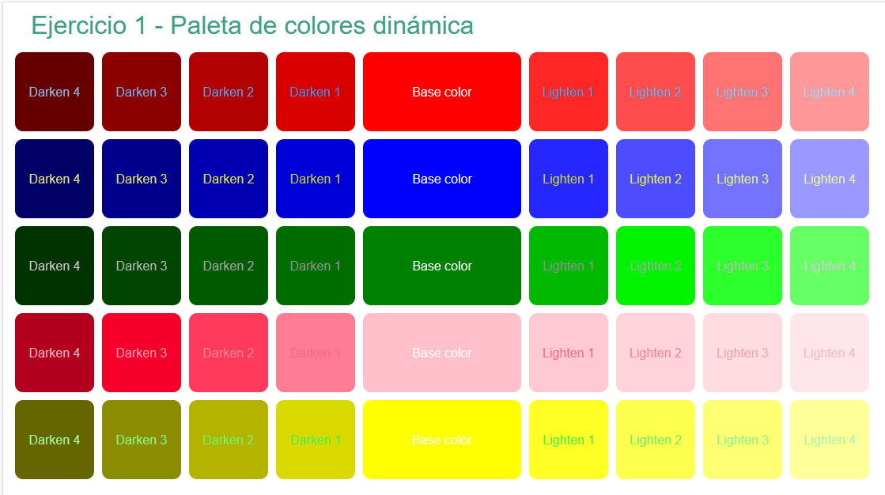

# Módulo 1 - Layout - Laboratorio Básico

## Ejercicio 1

<b>Crear una paleta de colores dinámica</b>

• Usar el lenguaje Sass para crear distintos temas de paletas de colores.

• La idea es partir de un color base, y a partir de ese color generar 4 colores más oscuros de manera gradual, y cuatro colores más claros de manera gradual.

• Para comprobar que todo está funcionando como se espera utilizar el html del enunciado.

## Resolución

Se han utilizado las funciones list y color de Sass

```CSS
@use "sass:color" as *;
@use "sass:list";
```

Dos listas una para los colores que se utilizan en la paleta y otra para los colores de las letras

```CSS
$colores: red, blue, green, pink, yellow;
$colores-letra: rgba(8, 141, 218, 0.89), rgba(166, 177, 10, 0.932), grey,
  rgb(247, 78, 106), rgb(34, 240, 51);
```

Generamos la paleta de colores con @mixin con un bucle @while:

```CSS
@mixin generar-paleta($color-paleta, $color-letra-paleta) {
  $i: 1;
  @while $i <= 4 {
    .lighten-#{$i} {
      background-color: scale($color-paleta, $lightness: $i * 15%);
      color: scale($color-letra-paleta, $lightness: $i * 15%);
    }

    .darken-#{$i} {
      background-color: scale($color-paleta, $lightness: -1 * $i * 15%);
      color: scale($color-letra-paleta, $lightness: $i * 15%);
    }

    $i: $i + 1;
  }
}
```

Y los contenedores se generan de forma dinámica con un bucle for en función de la longitud de la lista $colores.
Para cada contenedor se utiliza generar-paleta con @include y se utilizan los valores de la lista de $colores y $colores-letra que corresponda:

```CSS
@for $i from 1 through list.length($colores) {
  .container-#{$i} {
    display: flex;
    flex-direction: row;
    padding-left: 10px;
    text-align: center;
    .base-color {
      background-color: list.nth($colores, $i);
      color: white;
      width: 200px;
      height: 100px;
    }
    @include generar-paleta(
      list.nth($colores, $i),
      list.nth($colores-letra, $i)
    );
  }
}
```

## Resultado

El resultado para una paleta de 5 colores es:</p>



Si se quisieran añadir más colores con incluir el nuevo color en $colores y $colores-letra y el nuevo contenedor en index.html se generaría dinámicamente.
