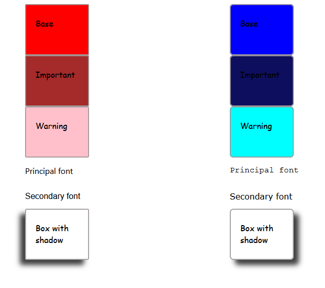

# Módulo 1 - Layout - Laboratorio Básico

## Ejercicio 2

<b>Crear dos temas distintos y mostrar los resultados en una página.</b>

Los cambios en el tema afectan a las siguientes características:

• Color

• Fuente

• Border Radius

• Shadow Box

Para visualizar los cambios debería ser suficiente importar un tema u otro en el fichero de estilos principal.

## Resolución

Se han utilizado las función list de Sass y se ha importado el archivo temas:

```CSS
@use "sass:list";
@use "temas" as temas;
```

En el archivo temas hemos incluido los valores de los dos temas:

```CSS
$numero-temas: 1, 2;
$base-color: red, blue;
$important-color: brown, rgb(14, 14, 94);
$warning-color: pink, aqua;
$principal-font: "Segoe UI", "Courier New";
$secondary-font: "Arial", "Verdana";
$shadow: -10px 10px 10px rgb(59, 59, 59), 10px 10px 10px rgb(59, 59, 59);
$border-radius: 3px, 7px;

```

Y se generan los dos contenedores de los temas de manera dinámica:

```CSS

@for $i from 1 through list.length(temas.$numero-temas) {
  .container-#{$i} {
    padding-left: 50px;
    color: black;
    width: 150px;
    height: 605px;
    .box {
      border-radius: list.nth(temas.$border-radius, $i);
    }
    .base {
      background-color: list.nth(temas.$base-color, $i);
    }
    .important {
      background-color: list.nth(temas.$important-color, $i);
    }
    .warning {
      background-color: list.nth(temas.$warning-color, $i);
    }
    .shadow {
      box-shadow: list.nth(temas.$shadow, $i);
    }
    .principal-font {
      font-family: list.nth(temas.$principal-font, $i);
    }
    .secondary-font {
      font-family: list.nth(temas.$secondary-font, $i);
    }
  }
}

```

## Resultado

El resultado es:</p>


