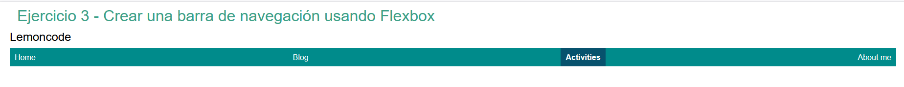
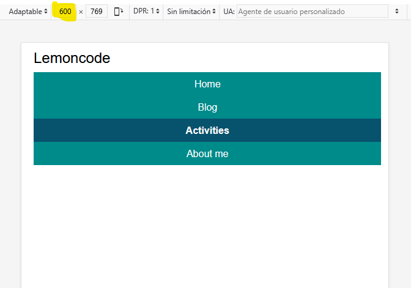

# Módulo 1 - Layout - Laboratorio Básico

## Ejercicio 3

<b>Crear la barra de navegación de la imagen usando Flexbox..</b>

## Resolución

Hemos creado en el html una navbar con 4 item:

```html
<body>
  <h1>Ejercicio 3 - Crear una barra de navegación usando Flexbox</h1>
  <div class="container">
    <h2>Lemoncode</h2>
    <div class="navbar">
      <div class="item"><a href="#">Home</a></div>
      <div class="item"><a href="#">Blog</a></div>
      <div class="item"><a href="#">Activities</a></div>
      <div class="item"><a href="#">About me</a></div>
    </div>
  </div>
</body>
```

Y en el CSS utilizamos una disposición flex en row

```CSS
.navbar {
  width: 98%;
  display: flex;
  flex-direction: row;
  flex-wrap: nowrap;
  box-sizing: border-box;
  background-color: darkcyan;
  margin: 10px;
  justify-content: space-between;
  list-style: none;
}
```

Se ha incluido un efecto hover para que cambie de color y la letra se convierta en negrita:

```CSS
.navbar .item:hover {
  background-color: #07526d;

  a:hover {
    font-weight: bold;
  }
}
```

Y además se ha incluido una media query para que cuando la resolución sea como máximo de 600px la navbar cambie la disposición a column y se centre el texto:

```CSS
@media screen and (max-width: 600px) {
  .navbar {
    flex-direction: column;
    justify-content: flex-start;
  }
  .navbar .item {
    text-align: center;
  }
  h1 {
    display: none;
  }
}
```

## Resultado

El resultado para una resolución mayor de 600px es:



Y para una resolución de 600px:


