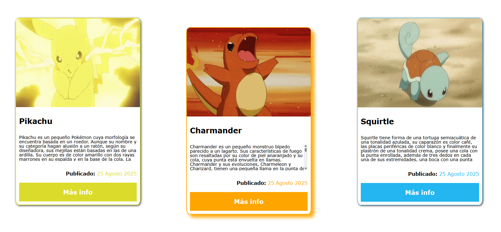
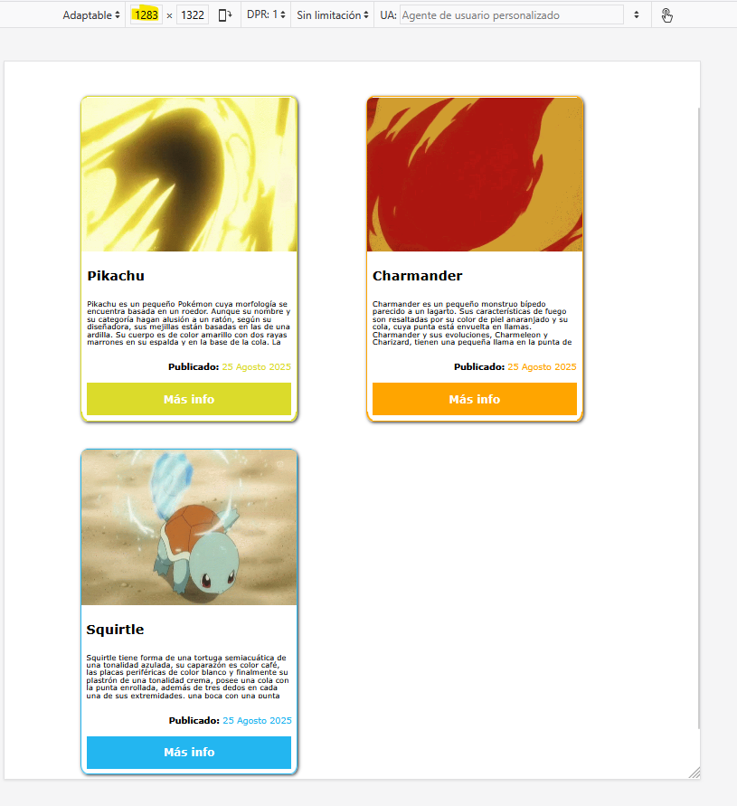
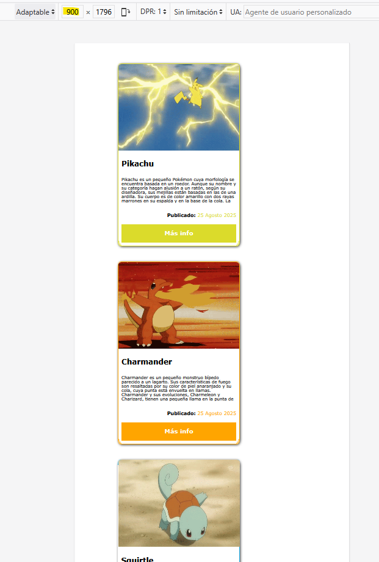

# Módulo 1 - Layout - Laboratorio Básico

## Ejercicio 4

<b>Crearemos un elemento de tipo card con Grid CSS.</b>

Las alineaciones deberán hacerse con esta característica, pero el html es totalmente abierto.

## Resolución

Se crea un div con la clase cards con disposición grid en tres columnas:

```CSS
.cards {
  display: grid;
  grid-template-columns: repeat(3, 1fr);
  margin: 110px 140px;
  grid-gap: 50px;
}
```

Se han creado tres cards con los border redondeados y sombreados simulando unas cartas de Pokemon.

En cada carta se incluye la información del pokemon de la imagen en formato gif, se muestran 6 líneas y con un scroll se puede leer toda la información. Además tienen un color diferente en los bordes, botón y fecha de publicación acorde con el color del pokemon.

Se ha incluido para cada carta un hover para que cambie en el eje Y y la sombra. Por ejemplo para la carta de Charmander:

```CSS
.card-2 {
  display: flex;
  flex-direction: column;
  border: 2px solid orange;
  height: 600px;
  width: 400px;
  border-radius: 3%;
  box-shadow: 2px 2px 6px 0px rgb(59, 59, 59);
}
.card-2:hover {
  transform: translateY(30px);
  box-shadow: 10px 10px 10px 0px rgba(255, 168, 6, 0.925);
}
```

El diseño es responsive y al disminuir el ancho de la página pasa de tres a dos cards, y después a una card:

```CSS
@media screen and (max-width: 1430px) {
  .cards {
    grid-template-columns: repeat(2, 1fr);
  }
}

@media screen and (max-width: 950px) {
  .cards {
    grid-template-columns: 1fr;
  }
}

```

## Resultado

El resultado es:



Y para las diferentes resoluciones:




