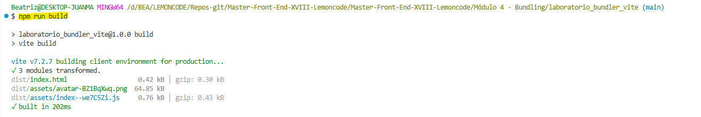
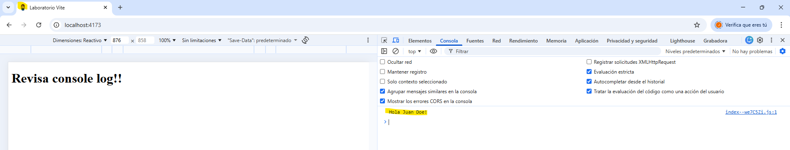
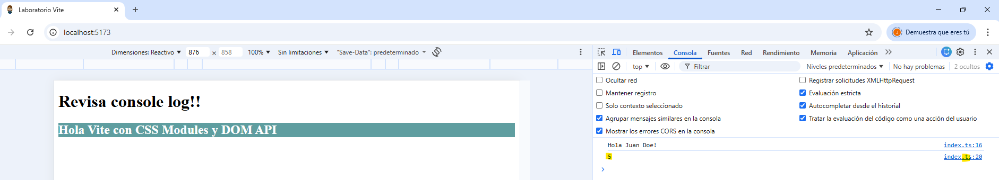
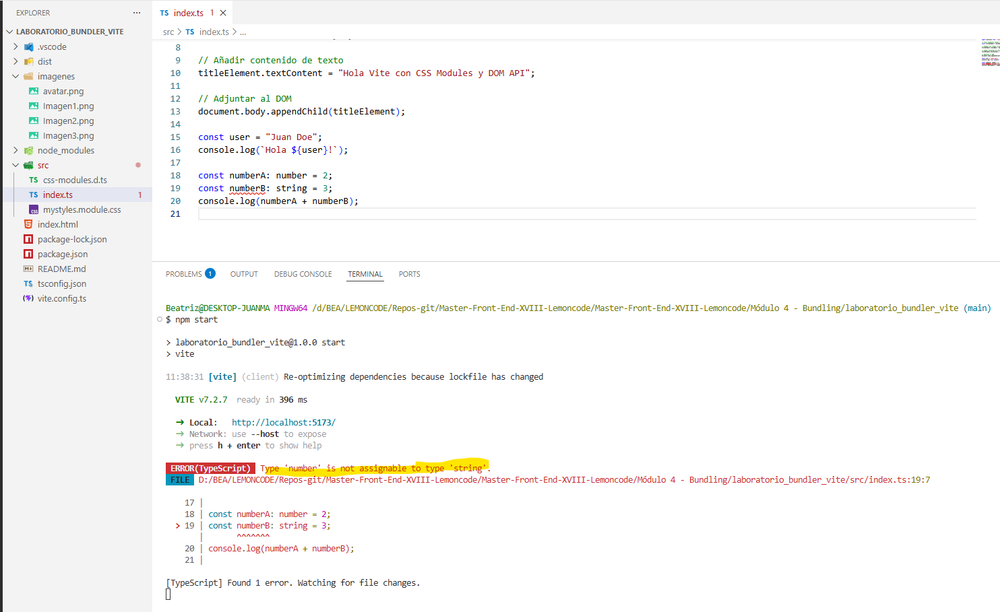
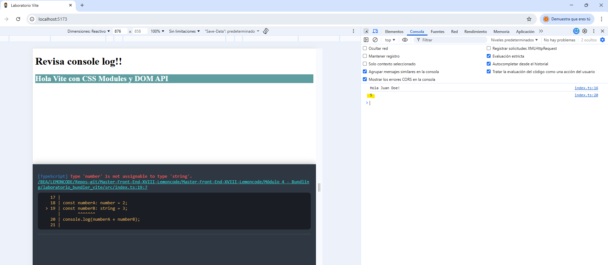
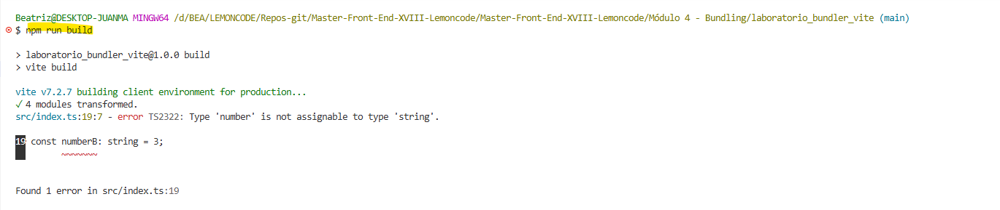
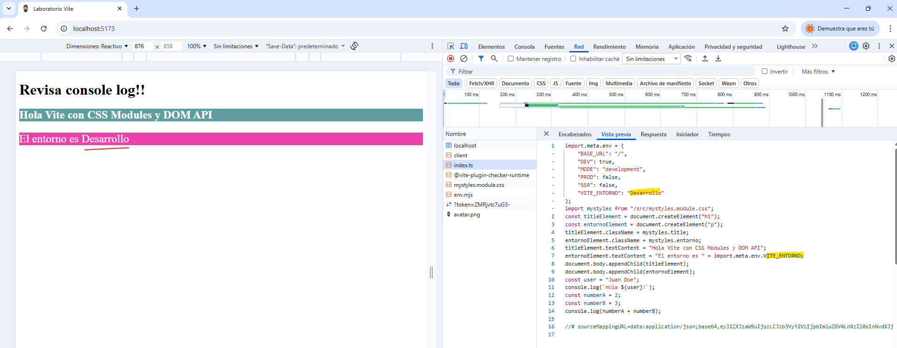
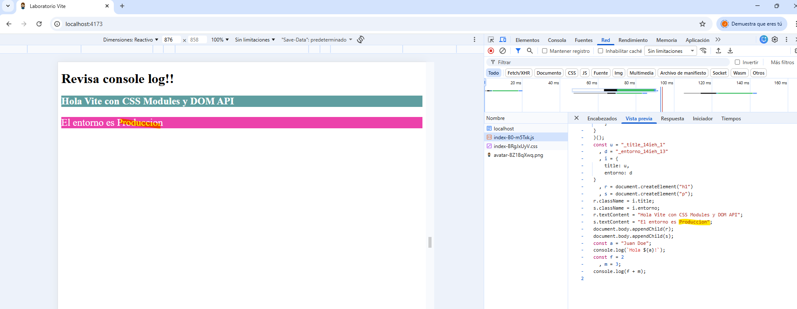
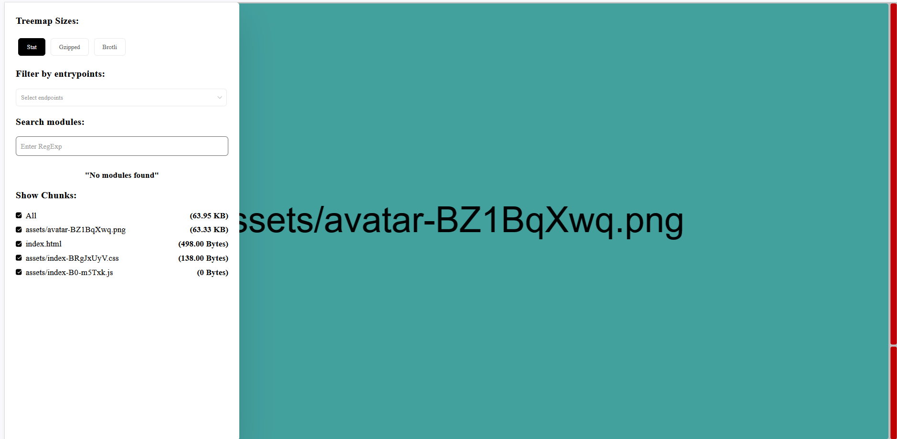
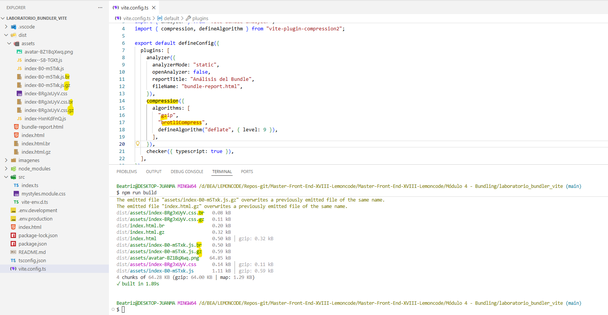

# Módulo 4 - Laboratorio Bundling con Vite

## Obligatorio

Montar una semilla de proyecto con Vite que:

• Esté configurado con TypeScript y que permita detectar errores de tipos en la terminal si los hubiera.

• Se pueda ver el tamaño del bundle.

• Tenga los scripts start para levantar el servidor de desarrollo y preview para levantar el bundle de producción.

• Tenga variables de entorno (diferentes en desarrollo y producción). Puedes usar una cadena de texto que muestres con un console.log donde en desarrollo, mientras lo levantas en local con npm start tenga un valor, pero al hacer la build y verlo con npm run preview tenga otro valor.

• Creéis un elemento H1 con texto utilizando la API del DOM y ese H1 esté estilado con CSSModules.

## Opcional

Añadir al proyecto semilla de Vite la configuración necesaria para que al hacer la build también genere los ficheros de forma comprimida (GZIP y BROTLI), por lo que al hacer la build deberán existir los ficheros dist/index.js.gz y un dist/index.js.br.

## Solución Obligatoria

Primero creamos una carpeta vacía (laboratorio_bundler_vite) para nuestro proyecto.

Iniciamos el proyecto con npm:

```bash
npm init -y
```

Con -y le indicamos que coja los valores predeterminados.Nos genera el archivo package.json.

Instalamos Vite:

```bash
npm install vite --save-dev
```

Creamos una carpeta src con un archivo **`index.js`**

_./src/index.js_

```js
const user = "Juan Doe";
console.log(`Hola ${user}!`);
```

Y el archivo **`index.html`** que es el punto de entrada al que le hemos incluido un favicon para que aparezca en la pestaña del navegador y no de el error 404:

_/index.html_

```html
<!DOCTYPE html>
<html lang="en">
  <head>
    <meta charset="UTF-8" />
    <meta name="viewport" content="width=device-width, initial-scale=1.0" />
    <title>Laboratorio Vite</title>
    <link rel="icon" type="image/png" href="imagenes/avatar.png" />
  </head>
  <body>
    <h1>Revisa console log!!</h1>
    <script type="module" src="/src/index.js"></script>
  </body>
</html>
```

### Tenga los scripts start para levantar el servidor de desarrollo y preview para levantar el bundle de producción

Incluimos el script para producción:

_./package.json_

```diff
{
  "scripts": {
+   "build": "vite build"
-   "test": "echo \"Error: no test specified\" && exit 1"
  },
  ...
}
```

Lo ejecutamos:

```bash
npm run build
```



Incluimos preview para levantar el bundle de producción:

_./package.json_

```diff
{
  "scripts": {
    "build": "vite build",
+   "preview":"vite preview"
  },
  ...
}
```

Ejecutamos preview:

```bash
npm run preview
```



Incluimos start para levantar el servidor de desarrollo:

_./package.json_

```diff
{
  "scripts": {
    "build": "vite build",
    "preview":"vite preview",
+   "start":"vite"
  },
  ...
}
```

Ejecutamos start:

```bash
npm start
```


### Creéis un elemento H1 con texto utilizando la API del DOM y ese H1 esté estilado con CSSModules.

Para utilizar CSSModules hay que crear la hoja de estilos incluyendo _module_ en el nombre **`mystyles.module.css`**:

```css
.title {
  background-color: cadetblue;
  color: white;
  font-size: 24px;
}
```

Importamos el archivo en **`index.js`** y utilizamos la clase **`title`** en el H1 que hemos generado:

_./src/index.js_

```diff
+ import mystyles from "./mystyles.module.css";

+ // Crear elementos usando la API del DOM
+ const titleElement = document.createElement("h1");

+ // Asignar las clases únicas generadas por Vite
+ titleElement.className = mystyles.title;

+ // Añadir contenido de texto
+ titleElement.textContent = "Hola Vite con CSS Modules y DOM API";

+ // Adjuntar al DOM
+ document.body.appendChild(titleElement);

const user = "Juan Doe";
console.log(`Hola ${user}!`);
```

### Esté configurado con TypeScript y que permita detectar errores de tipos en la terminal si los hubiera.

Modificamos el archivo **`index.js`** a **`index.ts`** y también el archivo **`index.html`**

_./index.html_

```diff
<!DOCTYPE html>
<html lang="en">
  <head>
    <meta charset="UTF-8" />
    <meta name="viewport" content="width=device-width, initial-scale=1.0" />
    <title>Laboratorio Vite</title>
    <link rel="icon" type="image/png" href="imagenes/avatar.png" />
  </head>
  <body>
    <h1>Revisa console log!!</h1>
-   <script type="module" src="/src/index.js"></script>
+   <script type="module" src="/src/index.ts"></script>
  </body>
</html>
```

Al hacer este cambio da un error (Cannot find module './mystyles.module.css') al importar el archivo css.

Para solucionarlo creo un archivo para definir los tipos:

_./src/css-modules.d.ts_

```css
declare module "*.module.css" {
  const classes: { [key: string]: string };
  export default classes;
}
```

Incluimos código de typescrpt:

_./src/index.ts_

```diff
import mystyles from "./mystyles.module.css";

// Crear elementos usando la API del DOM
const titleElement = document.createElement("h1");

// Asignar las clases únicas generadas por Vite
titleElement.className = mystyles.title;

// Añadir contenido de texto
titleElement.textContent = "Hola Vite con CSS Modules y DOM API";

// Adjuntar al DOM
document.body.appendChild(titleElement);

const user = "Juan Doe";
console.log(`Hola ${user}!`);

+ const numberA: number = 2;
+ const numberB: number = 3;
+ console.log(numberA + numberB);
```

Y vemos que Vite lo resuelve sin necesidad de transpiladores:



Creamos un archivo para la configuración **`tsconfig.json`**:

_.tsconfig.json_

```
{
  "compilerOptions": {
    "esModuleInterop": true,
    "isolatedModules": true,
    "lib": ["ESNext", "DOM"],
    "module": "ESNext",
    "moduleResolution": "bundler",
    "noEmit": true,
    "noImplicitAny": false,
    "noImplicitReturns": true,
    "resolveJsonModule": true,
    "skipLibCheck": true,
    "sourceMap": true,
    "target": "ESNext",
    "useDefineForClassFields": true
  },
  "include": ["src"]
}
```

Instalamos typescript:

```bash
npm install typescript --save-dev
```

Para poder detectar errores de tipo en la consola primero instalamos un plugin:

```bash
npm install vite-plugin-checker --save-dev
```

Y creamos un archivo **`vite.config.ts`** en el que importamos el plugin y creamos una instancia para que valide los tipo de typescript:

_vite.config.ts_

```
import { defineConfig } from "vite";
import checker from "vite-plugin-checker";

export default defineConfig({
  plugins: [checker({ typescript: true })],
});
```

Incluimos un error de tipo en el archivo **`index.ts`** :

_./src/index.ts_

```diff
import mystyles from "./mystyles.module.css";

// Crear elementos usando la API del DOM
const titleElement = document.createElement("h1");

// Asignar las clases únicas generadas por Vite
titleElement.className = mystyles.title;

// Añadir contenido de texto
titleElement.textContent = "Hola Vite con CSS Modules y DOM API";

// Adjuntar al DOM
document.body.appendChild(titleElement);

const user = "Juan Doe";
console.log(`Hola ${user}!`);

const numberA: number = 2;
- const numberB: number = 3;
+ const numberB: string = 3;
console.log(numberA + numberB);
```

Y al arrancar la aplicación ya aparece el error en la consola:



Y aunque vemos que sigue funcionando también aparece el error en el navegador:



Si queremos que no aparezca el overlay en el navegador:

_vite.config.ts_

```
import { defineConfig } from "vite";
import checker from "vite-plugin-checker";

export default defineConfig({
  plugins: [checker({ typescript: true ,overlay: false})],
});
```

Y comprobamos que no deja generar el código de producción:



### Tenga variables de entorno (diferentes en desarrollo y producción). Puedes usar una cadena de texto que muestres con un console.log donde en desarrollo, mientras lo levantas en local con npm start tenga un valor, pero al hacer la build y verlo con npm run preview tenga otro valor.

Creamos un fichero de tipos **`src/vite-env.d.ts`** en el que se indica que utilice los tipos de vite/client.

_src/vite-env.d.ts_

```
/// <reference types="vite/client" />
interface ImportMetaEnv {
  readonly VITE_ENTORNO: string;
  // más variables de entorno...
}

interface ImportMeta {
  readonly env: ImportMetaEnv;
}
```

Ya no será necesario el fichero **`css-modules.d.ts`** por lo que lo borramos.

Creamos un fichero para el entorno de desarrollo **`env.development`** con la variable VITE_ENTORNO:

_env.development_

```
VITE_ENTORNO = Desarrollo
```

Y para el entorno de producción creamos **`env.production`** con la variable VITE_ENTORNO:

_env.production_

```
VITE_ENTORNO = Producción
```

Incluimos una nueva clase para mostrar la variable de entorno en **`mystyles.module.css`**:

```diff
.title {
  background-color: cadetblue;
  color: white;
  font-size: 24px;
}
+ .entorno {
+  background-color: rgb(236, 65, 171);
+  color: white;
+  font-size: 24px;
+}
```

En el archivo **`index.ts`** utilizamos la clase **`entorno`** en un nuevo párrafo que hemos generado y la variable VITE_ENTORNO:

_./src/index.ts_

```diff
import mystyles from "./mystyles.module.css";

// Crear elementos usando la API del DOM
const titleElement = document.createElement("h1");
+ const entornoElement = document.createElement("p");

// Asignar las clases únicas generadas por Vite
titleElement.className = mystyles.title;
+ entornoElement.className = mystyles.entorno;

// Añadir contenido de texto
titleElement.textContent = "Hola Vite con CSS Modules y DOM API";
+ entornoElement.textContent = "El entorno es " + import.meta.env.VITE_ENTORNO

// Adjuntar al DOM
document.body.appendChild(titleElement);
+ document.body.appendChild(entornoElement);

const user = "Juan Doe";
console.log(`Hola ${user}!`);
```

Y comprobamos que se muestra la variable en el entorno de desarrollo:



Y en producción:



Se puede consultar más información en la documentación de [Vite](https://es.vite.dev/guide/env-and-mode)

### Se pueda ver el tamaño del bundle.

Instalamos el plugin vite-bundle-analyzer

```bash
npm install vite-bundle-analyzer --save-dev
```

Incluimos el plugin en el archivo **`vite.config.ts`** y alguna configuración:
_vite.config.ts_

```diff
import { defineConfig } from "vite";
import checker from "vite-plugin-checker";
+ import { analyzer } from "vite-bundle-analyzer";

export default defineConfig({
  plugins: [
+  analyzer({
+     analyzerMode: "static",
+     openAnalyzer: false,
+     reportTitle: "Análisis del Bundle",
+     fileName: "bundle-report.html",
+     }),
  checker({ typescript: true ,overlay: false}),
  ],
});
```

Y para ejecutarlo con el comando

```bash
npx vite-bundle-analyzer
```

Y el resultado:



## Solución Opcional

### Añadir al proyecto semilla de Vite la configuración necesaria para que al hacer la build también genere los ficheros de forma comprimida (GZIP y BROTLI), por lo que al hacer la build deberán existir los ficheros dist/index.js.gz y un dist/index.js.br.

Para comprimir los ficheros a formato GZIP (.gz) y BROTLI (.br) durante el proceso de build de Vite, utilizamos el plugin vite-plugin-compression2.
Lo instalamos:

```bash
npm install vite-plugin-compression2 --save-dev
```

Incluimos el plugin en el archivo **`vite.config.ts`** y alguna configuración:
_vite.config.ts_

```diff
import { defineConfig } from "vite";
import checker from "vite-plugin-checker";
import { analyzer } from "vite-bundle-analyzer";
+ import { compression, defineAlgorithm } from "vite-plugin-compression2";
export default defineConfig({
  plugins: [
  analyzer({
     analyzerMode: "static",
     openAnalyzer: false,
     reportTitle: "Análisis del Bundle",
     fileName: "bundle-report.html",
     }),
+ compression({
+    algorithms: [
+      "gzip",
+      "brotliCompress",
+      defineAlgorithm("deflate", { level: 9 }),
+     ],
+ }),
  checker({ typescript: true ,overlay: false}),
  ],
});
```

Y el resultado:


