# Módulo 4 - Laboratorio Bundling con Webpack

## Obligatorio

Implementar una aplicación simple que:

• Tenga el bundling montado con webpack.

• Muestre un logo (por ejemplo el de lemoncode u otro que queráis).

• Muestre el texto "hola mundo" estilado con SASS.

## Opcional

Esta parte es opcional, por si queréis seguir practicando. Aquí podéis encontrar los pasos de como hacerlo. <a href="https://github.com/Lemoncode/master-frontend-lemoncode/tree/master/03-bundling/01-webpack" title="Repositorio webpack">Repositorio webpack</a>.

• Mostrar un hola mundo desarrollado con React.

• Añadir typescript

• Tener una versión de build de producción.

• Tener variables de entorno para diferentes entornos (desarrollo y producción).

• Tener una forma de medir cuanto ocupa cada librería y nuestro código en el bundle.

---

También crear un archivo .gitignore, en la parte de webpack añadir la carpeta node_modules y la carpeta dist.

Quedaría una cosa así:

```javascript
node_modules;
dist;
```

## Solución Obligatoria

Primero creamos una carpeta vacía (laboratorio_bundler_webpack) para nuestro proyecto e incluimos el archivo **`.gitignore`** para excluir las carpetas node_modules y dist:

_./src/.gitignore_

```
node_modules
dist
```

### Paso 1 - Instalar Webpack

Iniciamos el proyecto con npm:

```bash
npm init -y
```

Con -y le indicamos que coja los valores predeterminados.

Nos genera el archivo package.json:

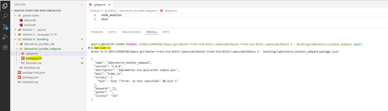

Luego instalamos los paquetes webpack y webpack-cli para trabajar con Webpack con dependencias de desarrollo (-dev):

```bash
npm install webpack webpack-cli --save-dev
```

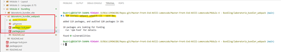

Para iniciar webpack, modificamos el archivo package.json y agregamos la siguiente propiedad "build": "webpack --mode development" debajo del objeto scripts.

Este script nos permite lanzar webpack desde la línea de comandos a través de npm escribiendo:

```bash
 npm run build
```

El archivo **`package.json`** quedará así:

_./package.json_

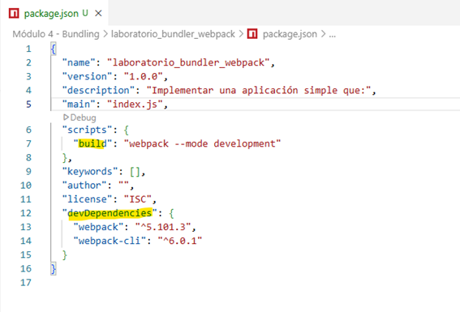

Creamos una carpeta **`src`** donde se guardarán todos los sources. Y creamos un archivo **`index.js`** que será el punto de entrada.

Incluimos un console.log para ver que todo funciona correctamente:

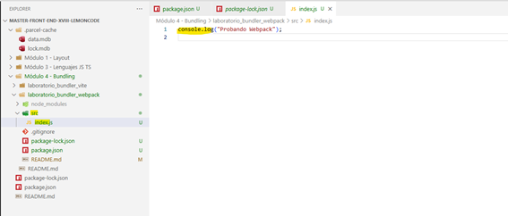

Y ahora si ejecutamos el script build:

```bash
npm run build
```

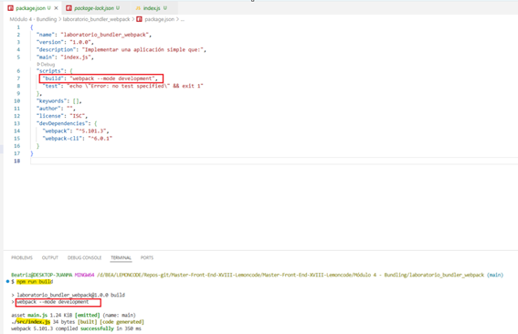

Obtendremos el bundle bajo la ruta ./dist y con un archivo llamado **`main.js`** que es el nombre que le da por defecto.

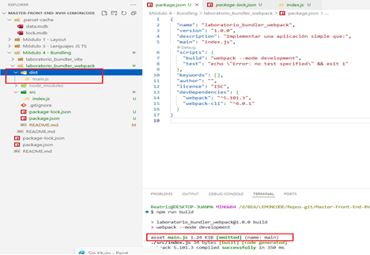

En nuestro proyecto utilizaremos ES6, pero para que nuestro código sea compatible con navegadores antiguos hay que utilizar una librería para transpilar el código.

Utilizaremos la librería <a href="https://babeljs.io/" title="Babel">Babel</a> y para instalarla ejecutaremos:

```bash
npm install @babel/cli @babel/core @babel/preset-env --save-dev
```

Necesitamos instalar un loader para que webpack pueda hacer uso del transpilador babel-core, un loader hace de puente entre webpack y la herramienta final que usemos:

```bash
npm install babel-loader --save-dev
```

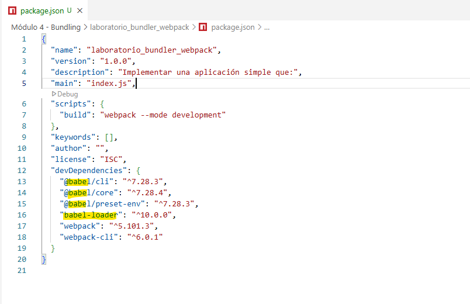

Para configurar Babel creamos el fichero **`.babelrc`** y en él incluimos el <a href="https://babeljs.io/docs/babel-preset-env" title="preset">preset</a> que debe utilizar:

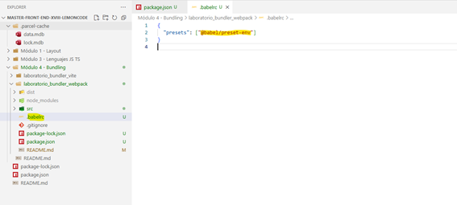

Incluimos dentro del archivo **`index.js`** el siguiente código:

```js
const randomNumber = Math.random();
const texto = `random number is ${randomNumber}`;

const title = document.createElement("h1");
title.innerText = texto;
document.body.appendChild(title);
```

Y creamos también un archivo **`index.html`** para referenciar al **`main.js`**

```html
<!DOCTYPE html>
<html lang="en">
  <head>
    <meta charset="UTF-8" />
    <meta name="viewport" content="width=device-width, initial-scale=1.0" />
    <title>Webpack</title>
  </head>
  <body>
    <script src="../dist/main.js"></script>
  </body>
</html>
```

Y vemos como se muestra en el navegador:

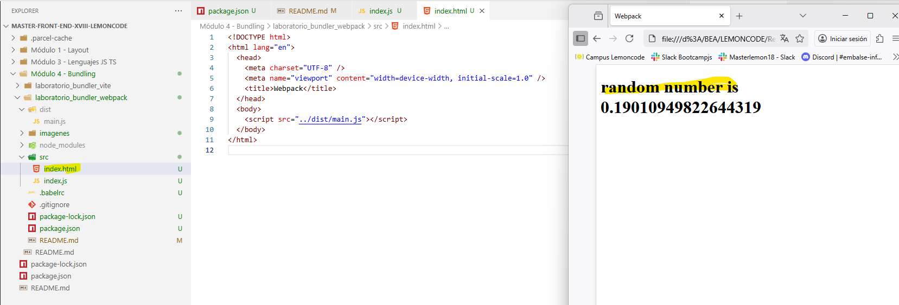

### Paso 2 - Configurar Webpack

Creamos un fichero de configuración **`webpack.config.js`** donde indicaremos las reglas, o loaders, para los diferentes tipos de ficheros.

Incluimos en este fichero que para los archivos de tipo .js, excepto los de la carpeta node_modules, se use babel-loader:

_./webpack.config.js_

```
export default {
  module: {
    rules: [
      {
        test: /\.js$/,
        exclude: /node_modules/,
        loader: "babel-loader",
      },
    ],
  },
};
```

Para que no falle al ejecutar build hay que incluir

_./package.json_

```diff
{
+ "type": "module",
    "scripts": {
    "build": "webpack --mode development"
  },
  ...
}
```

### Paso 3 - Servidor web desarrollo

Para ir probando nuestros desarrollos hay que levantar un servidor web ligero en local donde se ejecutará nuestra aplicación.

Para ello instalamos webpack-dev-server:

```bash
npm install webpack-dev-server --save-dev
```

Usando este librería ya no será necesario ejecutar el script build para ver los cambios en el navegador y tampoco será necesaria la carpeta **`dist`** (el servidor se ejecuta en memoria y no vuelca la información en esta carpeta) por lo que la eliminamos.

Ahora para indicarle a webpack en que carpeta buscar el index.html incluimos en la configuración:

_./webpack.config.js_

```diff
+ import path from "path";
+ import url from "url";

+ const __dirname = path.dirname(url.fileURLToPath(import.meta.url));

export default {
  module: {
    rules: [
      {
        test: /\.js$/,
        exclude: /node_modules/,
        loader: "babel-loader",
      },
    ],
  },
+ devServer: {
+ static: path.join(__dirname, "./src"),
+ },
};
```

Se cambia el archivo **`index.html`**

_./index.html_

```diff
<!DOCTYPE html>
<html lang="en">
  <head>
    <meta charset="UTF-8" />
    <meta name="viewport" content="width=device-width, initial-scale=1.0" />
    <title>Webpack</title>
  </head>
  <body>
- <script src="../dist/main.js"></script>
+ <script src="./main.js"></script>
  </body>
</html>
```

Además hay que incluir un nuevo script _start_:

_./package.json_

```diff
{
    "scripts": {
+ "start": "webpack serve --mode development",
    "build": "webpack --mode development"
  },
  ...
}
```

Y ahora ejecutamos:

```bash
npm start
```

Y vemos como se muestra en el puerto 8080:

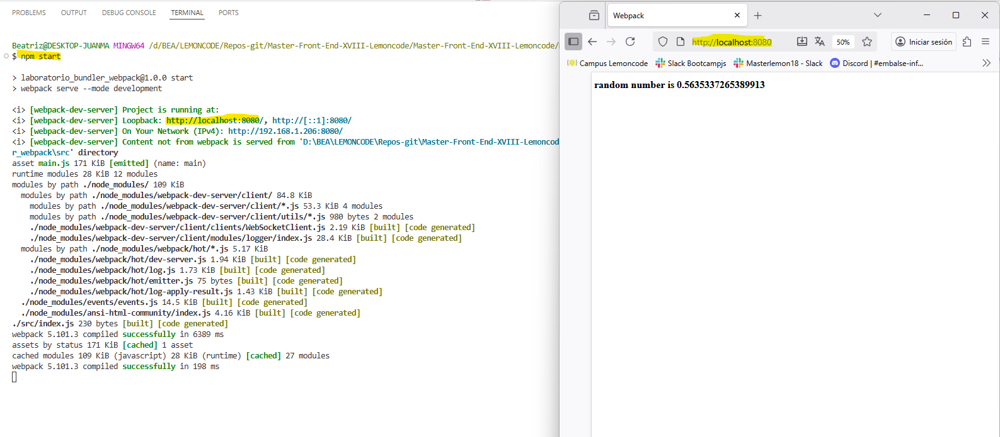

Este servidor detecta cualquier cambio en algún archivo .js y refresca la página automáticamente.

### Paso 4 - HTML Webpack Plugin

Para la creación de archivos HTML utilizamos el plugin <a href="https://github.com/jantimon/html-webpack-plugin" title="plugin">HTML Webapck Plugin</a> y para instalarlo:

```bash
npm install html-webpack-plugin --save-dev
```

Con este plugin ya no es necesario decirle al servidor la ruta del _index.html_:

_./webpack.config.js_

```diff
- import path from "path";
- import url from "url";

- const __dirname = path.dirname(url.fileURLToPath(import.meta.url));

+ import HtmlWebpackPlugin from "html-webpack-plugin";
export default {
  module: {
    rules: [
      {
        test: /\.js$/,
        exclude: /node_modules/,
        loader: "babel-loader",
      },
    ],
  },
- devServer: {
- static: path.join(__dirname, "./src"),
- },
+   plugins: [
+    new HtmlWebpackPlugin({
+     filename: "index.html",
+     template: "./src/index.html",
+     scriptLoading:"blocking",
+     hash: true,
+   }),
+ ],
};
```

Y tampoco es necesario el script en el archivo **`index.html`**

_./index.html_

```diff
<!DOCTYPE html>
<html lang="en">
  <head>
    <meta charset="UTF-8" />
    <meta name="viewport" content="width=device-width, initial-scale=1.0" />
    <title>Webpack</title>
  </head>
  <body>
- <script src="./main.js"></script>
  </body>
</html>
```

Ahora al hacer el build se genera el archivo HTML en la carpeta dist con el script hasheado:

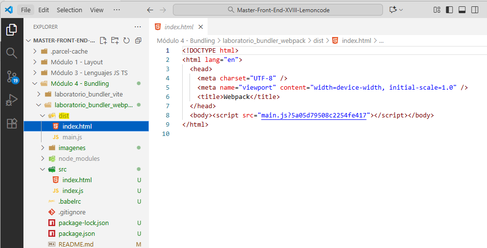

### Paso 5 - Incluir estilos CSS

Primero creamos una hoja css **`mystyles.css`** donde incluiremos los estilos en la class cadetblue-background:

_./mystyles.css_

```CSS
.cadetblue-background {
  background-color: cadetblue;
  color: white;
  font-weight: bold;
}
```

Incluimos en el **`index.html`** un h1 y un div con la class cadetblue-background:

_./index.html_

```diff
<!DOCTYPE html>
<html lang="en">
  <head>
    <meta charset="UTF-8" />
    <meta name="viewport" content="width=device-width, initial-scale=1.0" />
    <title>Webpack</title>
  </head>
  <body>
+    <h1>Hola Cobolero</h1>
+    <div class="cadetblue-background">Color de fondo</div>
  </body>
</html>
```

Ahora hay que configurar webpack para que aplique los estilos.

Primero instalamos los loaders necesarios para que Webpack lea los archivos CSS e inyecte los estilos en nuestra aplicación:

```bash
npm install style-loader css-loader --save-dev
```

Realizamos los siguientes cambios en la configuración:

_./webpack.config.js_

```diff
import HtmlWebpackPlugin from "html-webpack-plugin";

export default {
+  entry: ["./src/index.js", "./src/mystyles.css"],
  module: {
    rules: [
      {
        test: /\.js$/,
        exclude: /node_modules/,
        loader: "babel-loader",
      },
+ {
+ test: /\.css$/,
+ exclude: /node_modules/,
+ use: ['style-loader', 'css-loader'],
+ },
    ],
  },
   plugins: [
    new HtmlWebpackPlugin({
     filename: "index.html",
     template: "./src/index.html",
     scriptLoading:"blocking",
     hash: true,
   }),
 ],
};
```

Y el resultado de aplicar los estilos:

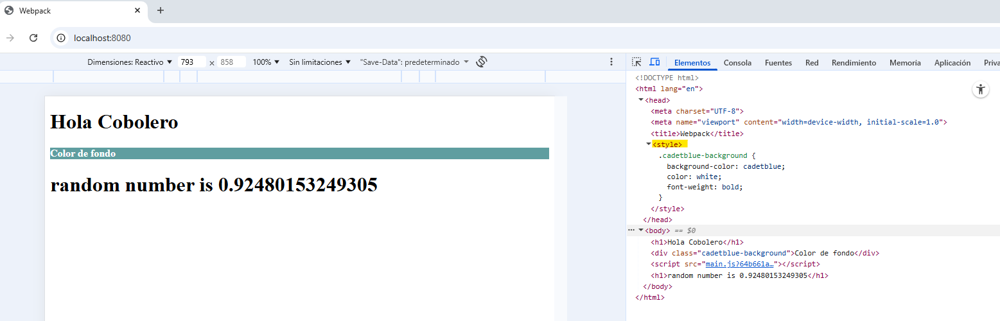

Ahora queremos que se generen dos bundles uno con el código y otro con los css:

_./webpack.config.js_

```diff
import HtmlWebpackPlugin from "html-webpack-plugin";

export default {
-  entry: ["./src/index.js", "./src/mystyles.css"],
+    entry: {
+    app:'./src/index.js',
+    appStyles: './src/mystyles.css'
+  },
  module: {
    rules: [
      {
        test: /\.js$/,
        exclude: /node_modules/,
        loader: "babel-loader",
      },
 {
 test: /\.css$/,
 exclude: /node_modules/,
 use: ['style-loader', 'css-loader'],
 },
    ],
  },
   plugins: [
    new HtmlWebpackPlugin({
     filename: "index.html",
     template: "./src/index.html",
     scriptLoading:"blocking",
     hash: true,
   }),
 ],
};
```

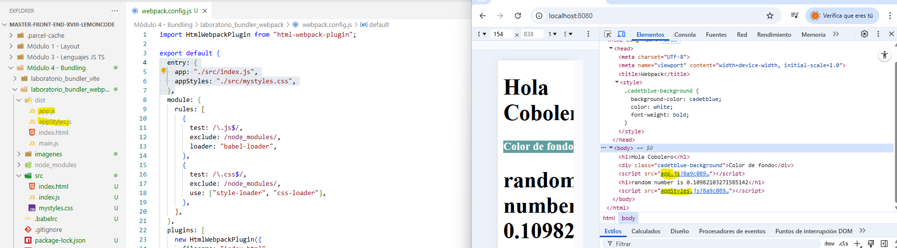

Para que el hash no se incluya en el script del index.html vamos a incluir un output en la configuración:

_./webpack.config.js_

```diff
import HtmlWebpackPlugin from "html-webpack-plugin";

export default {
    entry: {
    app:'./src/index.js',
    appStyles: './src/mystyles.css'
  },
+ output: {
+   filename: '[name].[chunkhash].js',
+   clean: true,
+ },
  module: {
    rules: [
      {
        test: /\.js$/,
        exclude: /node_modules/,
        loader: "babel-loader",
      },
 {
 test: /\.css$/,
 exclude: /node_modules/,
 use: ['style-loader', 'css-loader'],
 },
    ],
  },
   plugins: [
    new HtmlWebpackPlugin({
     filename: "index.html",
     template: "./src/index.html",
     scriptLoading:"blocking",
-     hash: true,
   }),
 ],
};
```

Para que los estilos estén separados en un archivo css instalamos:

```bash
npm install mini-css-extract-plugin --save-dev
```

_./webpack.config.js_

```diff
import HtmlWebpackPlugin from "html-webpack-plugin";
+ import MiniCssExtractPlugin from "mini-css-extract-plugin";

export default {
    entry: {
    app:'./src/index.js',
-   appStyles: './src/mystyles.css'
  },
 output: {
   filename: '[name].[chunkhash].js',
   clean: true,
 },
  module: {
    rules: [
      {
        test: /\.js$/,
        exclude: /node_modules/,
        loader: "babel-loader",
      },
      {
        test: /\.css$/,
        exclude: /node_modules/,
-       use: ['style-loader', 'css-loader'],
+       use: [MiniCssExtractPlugin.loader, "css-loader"],
      },
    ],
  },
   plugins: [
    new HtmlWebpackPlugin({
     filename: "index.html",
     template: "./src/index.html",
     scriptLoading:"blocking",
   }),
+    new MiniCssExtractPlugin({
+      filename: "[name].css",
+      chunkFilename: "[id].css",
+    }),
 ],
};
```

Para que no genere el archivo appStyles.js lo hemos eliminado de la configuración y lo importamos en el index.js:

_.src/index.js_

```diff
+ import "./mystyles.css";

const randomNumber = Math.random();
const texto = `random number is ${randomNumber}`;

const title = document.createElement("h1");
title.innerText = texto;
document.body.appendChild(title);
```

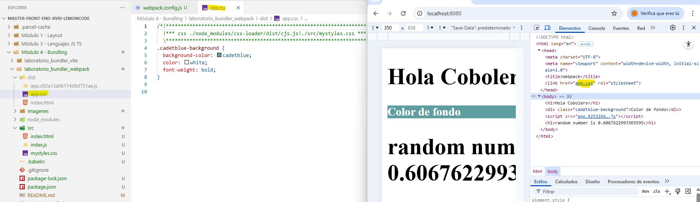

### Paso 6 - SASS

Primero cambiamos la extensión del archivo mystyles.css a **`mystyles.scss`** e incluimos las variables:

_.mystyles.scss_

```CSS
 $back-color: cadetblue;
 $letra-color: white;
 $font: bold;

.cadetblue-background {
  background-color: $back-color;
  color: $letra-color;
  font-weight: $font;
}
```

_.src/index.js_

```diff
- import "./mystyles.css";
+ import "./mystyles.scss";

const randomNumber = Math.random();
const texto = `random number is ${randomNumber}`;

const title = document.createElement("h1");
title.innerText = texto;
document.body.appendChild(title);
```

Instalamos los loader de Sass

```bash
npm install sass sass-loader --save-dev
```

_./webpack.config.js_

```diff
import HtmlWebpackPlugin from "html-webpack-plugin";
import MiniCssExtractPlugin from "mini-css-extract-plugin";

export default {
    entry: {
    app:'./src/index.js',
  },
 output: {
   filename: '[name].[chunkhash].js',
   clean: true,
 },
  module: {
    rules: [
      {
        test: /\.js$/,
        exclude: /node_modules/,
        loader: "babel-loader",
      },
+     {
+       test: /\.scss$/,
+       exclude: /node_modules/,
+       use: [MiniCssExtractPlugin.loader, "css-loader", "sass-loader"],
+     },
      {
        test: /\.css$/,
        exclude: /node_modules/,
        use: [MiniCssExtractPlugin.loader, "css-loader"],
 },
    ],
  },
   plugins: [
    new HtmlWebpackPlugin({
     filename: "index.html",
     template: "./src/index.html",
     scriptLoading:"blocking",
   }),
    new MiniCssExtractPlugin({
    filename: "[name].css",
    chunkFilename: "[id].css",
    }),
 ],
};
```

### Paso 7 - Refactorizar

En varios puntos de **`webapck.config.js`** utilizamos la ruta _`./src/`_

_./webpack.config.js_

```diff
import HtmlWebpackPlugin from "html-webpack-plugin";
import MiniCssExtractPlugin from "mini-css-extract-plugin";
+ import path from "path";
+ import url from "url";

+ const __dirname = path.dirname(url.fileURLToPath(import.meta.url));

export default {
+  context: path.resolve(__dirname, "./src"),
    entry: {
-    app:'./src/index.js',
+    app:'./index.js',
  },
 output: {
   filename: '[name].[chunkhash].js',
   clean: true,
 },
  module: {
    rules: [
      {
        test: /\.js$/,
        exclude: /node_modules/,
        loader: "babel-loader",
      },
    {
       test: /\.scss$/,
       exclude: /node_modules/,
       use: [MiniCssExtractPlugin.loader, "css-loader", "sass-loader"],
     },
      {
        test: /\.css$/,
        exclude: /node_modules/,
        use: [MiniCssExtractPlugin.loader, "css-loader"],
 },
    ],
  },
   plugins: [
    new HtmlWebpackPlugin({
     filename: "index.html",
-    template: "./src/index.html",
+    template: "./index.html",
     scriptLoading:"blocking",
   }),
    new MiniCssExtractPlugin({
    filename: "[name].css",
    chunkFilename: "[id].css",
    }),
 ],
};
```

### Paso 8 - Manejando imágenes

Se puede hacer de dos formas:

#### Vía JavaScript

Añadimos en index.html un div para la imagen

_./index.html_

```diff
<!DOCTYPE html>
<html lang="en">
  <head>
    <meta charset="UTF-8" />
    <meta name="viewport" content="width=device-width, initial-scale=1.0" />
    <title>Webpack</title>
  </head>
  <body>
    <h1>Hola Cobolero</h1>
    <div class="cadetblue-background">Color de fondo</div>
+   <div id="imgLogoJs"></div>
  </body>
</html>
```

E importamos la imagen y la añadimos por js:

_./index.js_

```diff
import "./mystyles.scss";
+ import logoImg from "./content/logocobol.png";
....................
+ const img = document.createElement("img");
+ img.src = logoImg;

+ document.getElementById("imgLogoJs").appendChild(img);
```

Añadimos una nueva regla en la configuración:

_./webpack.config.js_

```diff
import HtmlWebpackPlugin from "html-webpack-plugin";
import MiniCssExtractPlugin from "mini-css-extract-plugin";
import path from "path";
import url from "url";

const __dirname = path.dirname(url.fileURLToPath(import.meta.url));

export default {
  context: path.resolve(__dirname, "./src"),
    entry: {
    app:'./index.js',
  },
 output: {
   filename: '[name].[chunkhash].js',
   clean: true,
 },
  module: {
    rules: [
      {
        test: /\.js$/,
        exclude: /node_modules/,
        loader: "babel-loader",
      },
    {
       test: /\.scss$/,
       exclude: /node_modules/,
       use: [MiniCssExtractPlugin.loader, "css-loader", "sass-loader"],
     },
      {
        test: /\.css$/,
        exclude: /node_modules/,
        use: [MiniCssExtractPlugin.loader, "css-loader"],
     },
+     {
+       test: /\.(png|jpg)$/,
+       type: 'asset/resource',
+     },
    ],
  },
   plugins: [
    new HtmlWebpackPlugin({
     filename: "index.html",
     template: "./index.html",
     scriptLoading:"blocking",
   }),
    new MiniCssExtractPlugin({
    filename: "[name].css",
    chunkFilename: "[id].css",
    }),
 ],
};
```

Y le damos estilos a la imagen:

_.mystyles.css_

```diff
 $back-color: cadetblue;
 $letra-color: white;
 $font: bold;

.cadetblue-background {
  background-color: $back-color;
  color: $letra-color;
  font-weight: $font;
}
+img {
+  width: 200px;
+ }
```

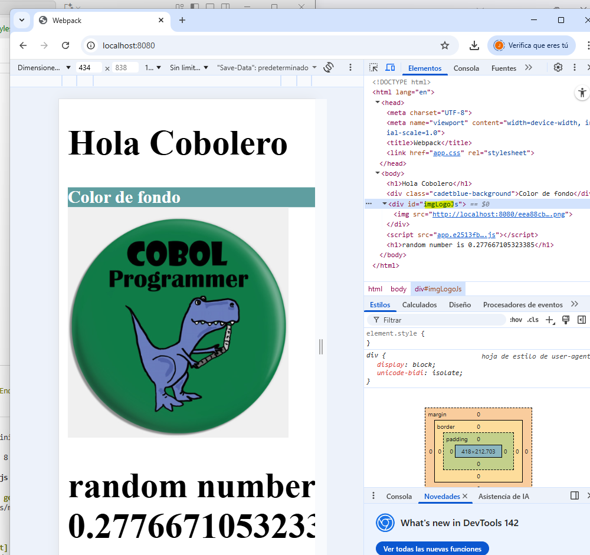

#### Vía HTML

Si la imagen estuviera en el HTML como  necesitaríamos un loader.

Añadimos en index.html la imagen

_./index.html_

```diff
<!DOCTYPE html>
<html lang="en">
  <head>
    <meta charset="UTF-8" />
    <meta name="viewport" content="width=device-width, initial-scale=1.0" />
    <title>Webpack</title>
  </head>
  <body>
    <h1>Hola Cobolero</h1>
+     
    <div class="cadetblue-background">Color de fondo</div>
    <div id="imgLogoJs"></div>
  </body>
</html>
```

Instalamos el loader correspondiente

```bash
npm install html-loader --save-dev
```

Y lo configuramos

./webpack.config.js

```diff
+     {
+      test: /\.html$/,
+      loader: 'html-loader',
+     },
    ],
  },
```

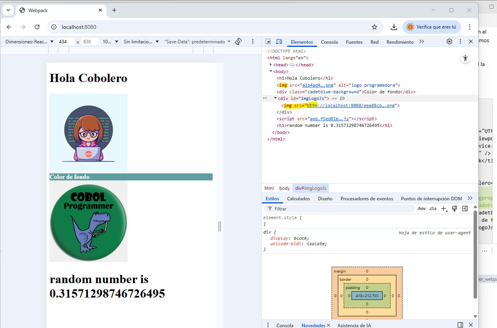

## Solución Opcional

### Mostrar un hola mundo desarrollado con React

En primer lugar instalamos la biblioteca de <a href="https://es.react.dev/" title="React">React</a>:

```bash
npm install react react-dom --save
```

Creamos el punto de entrada _root_ a nuestra aplicación en **`index.html`**:

_./index.html_

```diff
<!DOCTYPE html>
<html lang="en">
  <head>
    <meta charset="UTF-8" />
    <meta name="viewport" content="width=device-width, initial-scale=1.0" />
    <title>Webpack</title>
  </head>
  <body>
-    <h1>Hola Cobolero</h1>
-     
-    <div class="cadetblue-background">Color de fondo</div>
-    <div id="imgLogoJs"></div>
+    <div id="root"></div>
  </body>
</html>
```

Renombramos index.js a **`index.jsx`**, que es la extensión que utiliza React, y modificamos el contenido para inyectar un h1:

_./index.jsx_

```jsx
import React from "react";
import { createRoot } from "react-dom/client";

const root = createRoot(document.getElementById("root"));
root.render(
  <div>
    <h1>Hola desde React DOM</h1>
  </div>,
);
```

Para que Babel transpile los archivos .jsx a .js tenemos que instalar el preset:

```bash
npm install @babel/preset-react --save-dev
```

Modificamos el archivo de configuración de babel:

_./babelrc_

```diff
{
- "presets": ["@babel/preset-env"]
+ "presets": ["@babel/preset-env", "@babel/preset-react"]
}
```

Actualizamos **`webpack.config.js`**:

./webpack.config.js

```diff
  ...
  export default {
    context: path.resolve(__dirname, "./src"),
+   resolve: {
+     extensions: ['.js', '.jsx'],
+   },
    entry: {
-     app: './index.js',
+     app: './index.jsx',
      ...
    },
    module: {
      rules: [
        {
-         test: /\.js$/,
+         test: /\.jsx?$/,
          exclude: /node_modules/,
          loader: 'babel-loader',
        },
        ...
      ],
    },
    ...
  };
```

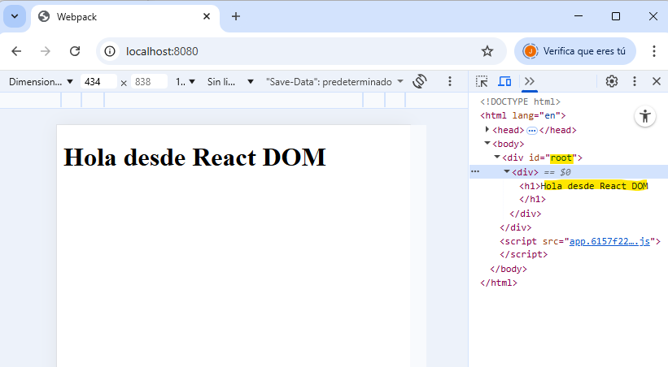

### Añadir Typescript

Primero instalamos Typescript:

```bash
npm install typescript --save-dev
```

El preset de Babel para Typescript:

```bash
npm install @babel/preset-typescript --save-dev
```

Modificamos el archivo de configuración de babel:

_./babelrc_

```diff
{
- "presets": ["@babel/preset-env", "@babel/preset-react"]
+ "presets": ["@babel/preset-env", "@babel/preset-react", "@babel/preset-typescript"]
}
```

Creamos un archivo **`tsconfig.json`** en la raiz del proyecto para indicar la configuración de Typescript para el proyecto:

_./tsconfig.json_

```
{
  "compilerOptions": {
    "target": "es6",
    "module": "es6",
    "moduleResolution": "node",
    "declaration": false,
    "noImplicitAny": false,
    "allowSyntheticDefaultImports": true,
    "sourceMap": true,
    "jsx": "react",
    "noLib": false,
    "skipLibCheck": true,
    "esModuleInterop": true
  },
  "include": ["src/**/*"],
  "exclude": ["node_modules"]
}
```

Actualizamos **`webpack.config.js`**:

_./webpack.config.js_

```diff
  ...
  export default {
    context: path.resolve(__dirname, "./src"),
    resolve: {
-     extensions: ['.js', '.jsx'],
+     extensions: [".js", ".ts", ".tsx"],
    },
    entry: {
-     app: './index.jsx',
+     app: './index.tsx',
      ...
    },
    module: {
      rules: [
        {
-         test: /\.jsx?$/,
+         test: /\.tsx?$/,
          exclude: /node_modules/,
          loader: 'babel-loader',
        },
        ...
      ],
    },
    ...
  };
```

Vamos a renombrar todos los archivos js/jsx a ts/tsx.

Instalamos los typings para React y React DOM:

```bash
npm install @types/react @types/react-dom --save-dev
```

TypeScript no sabe cómo importar un archivo scss, simplemente lo vamos a declarar como un módulo.

_./src/declaration.d.ts_

```
declare module "*.scss";
```

Si introducimos un error vemos que VSCode lo detecta:

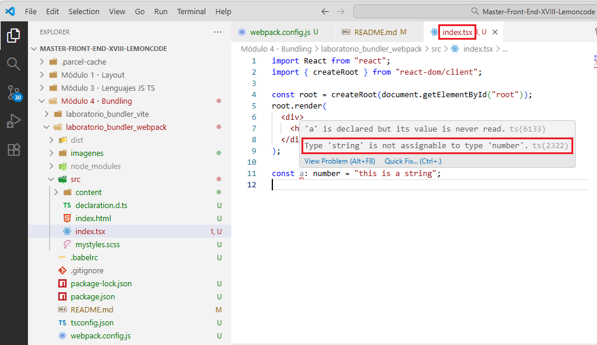

Pero Babel no realiza una comprobación de tipos. Vamos incluir la comprobación de tipos.

Pero para que no penalice el rendimiento instalamos primero un paquete que permite realizar ejecuciones en paralelo:

```bash
npm install npm-run-all --save-dev
```

Vamos a mejorar nuestro **`package.json`**, crearemos un nuevo comando solo para ejecutar el chequeo de tipos, y otro comando para ejecutar el proceso de build de webpack, después añadimos run-p para ejecutar ambos en paralelo:

./package.json

```diff
....
  "scripts": {
-	  "start": "webpack serve --mode development",
+   "start": "run-p -l type-check:watch start:dev",
+   "type-check": "tsc --noEmit",
+   "type-check:watch": "npm run type-check -- --watch",
+   "start:dev": "webpack serve --mode development",
    "build": "webpack --mode development"
  },
....
```

Para encontrar más rápidamente los errores de tipado modificamos **`webpack.config.js`** para incluir:

_./webpack.config.js_

```diff
+  devServer: {
+    port: 8080,
+    devMiddleware: { stats: "errors-only" },
+  },
```

Y aparece el error en la consola:

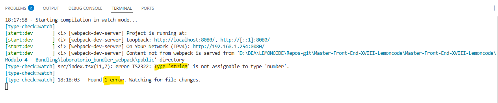

Si consultamos en el navegador el código, éste está transpilado y es dificil de depurar :

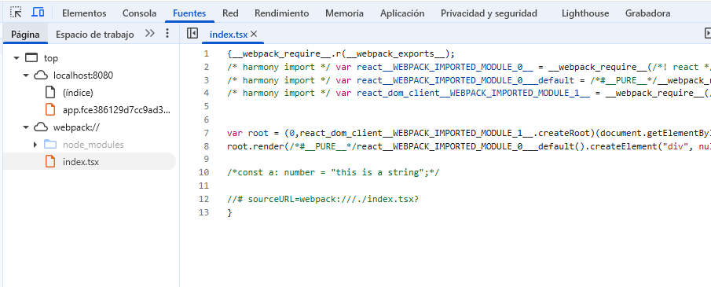

Para poder depurar con mayor facilidad los archivos _.ts_ vemos como generar ficheros map:

_./webpack.config.js_

```diff
+  devtool: 'eval-source-map',
   devServer: {
     port: 8080,
     devMiddleware: { stats: "errors-only" },
   },
```

Y ya se pueden poner breakpoints en los archivos .ts directamente:

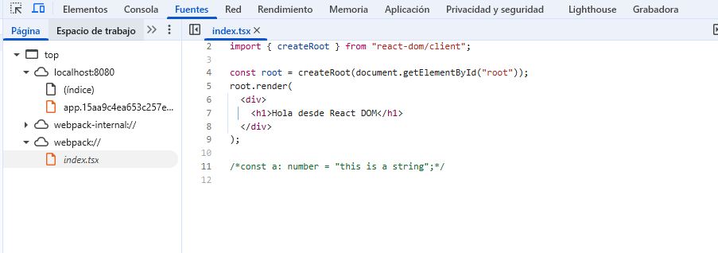

### Tener una versión de build de producción

Primero separamos la configuración de webpack en tres archivos:

- **`webpack.common.js`**: parte común
- **`webpack.dev.js`**: desarrollo
- **`webpack.prod.js`**: producción.

Para ello creamos el archivo **`webpack.common.js`** que contiene las configuraciones comunes que tenía _webpack.config.js_:

_./webpack.common.js_

```diff
import HtmlWebpackPlugin from "html-webpack-plugin";
- import MiniCssExtractPlugin from "mini-css-extract-plugin";
import path from "path";
import url from "url";

const __dirname = path.dirname(url.fileURLToPath(import.meta.url));

export default {
  context: path.resolve(__dirname, "./src"),
  resolve: {
    extensions: [".js", ".ts", ".tsx"],
  },
  entry: {
    app: "./index.tsx",
  },
  output: {
    filename: "[name].[chunkhash].js",
    clean: true,
  },
  module: {
    rules: [
      {
        test: /\.tsx?$/,
        exclude: /node_modules/,
        loader: "babel-loader",
      },
      {
-       test: /\.scss$/,
-       exclude: /node_modules/,
-       use: [MiniCssExtractPlugin.loader, "css-loader", "sass-loader"],
-     },
-     {
-      -test: /\.css$/,
-      -exclude: /node_modules/,
-      -use: [MiniCssExtractPlugin.loader, "css-loader"],
-     },
      {
        test: /\.(png|jpg)$/,
        type: "asset/resource",
      },
      {
        test: /\.html$/,
        loader: "html-loader",
      },
    ],
  },
  plugins: [
    new HtmlWebpackPlugin({
      filename: "index.html",
      template: "./index.html",
      scriptLoading: "blocking",
    }),
-   new MiniCssExtractPlugin({
-     filename: "[name].css",
-     chunkFilename: "[id].css",
-    }),
  ],
- devtool: "eval-source-map",
- devServer: {
-   port: 8080,
-   devMiddleware: { stats: "errors-only" },
- },
};
```

Para poder mezclar common y dev usamos la herramienta _webpack-merge_:

```bash
npm install webpack-merge --save-dev
```

Creamos el archivo para desarrollo **`webpack.dev.js`**:

_./webpack.dev.js_

```
import { merge } from "webpack-merge";
import common from "./webpack.common.js";
import path from "path";
import url from "url";

const __dirname = path.dirname(url.fileURLToPath(import.meta.url));

export default merge(common, {
  mode: "development",
  module: {
    rules: [
      {
        test: /\.scss$/,
        exclude: /node_modules/,
        use: ["style-loader", "css-loader", "sass-loader"],
      },
            {
        test: /\.css$/,
        exclude: /node_modules/,
        use: ["style-loader", "css-loader"],
      },
    ],
  },
  devtool: "eval-source-map",
  devServer: {
    port: 8080,
    devMiddleware: { stats: "errors-only" },
  },
});
```

Creamos el archivo para producción **`webpack.prod.js`**:

_./webpack.prod.js_

```
import { merge } from "webpack-merge";
import common from "./webpack.common.js";
import MiniCssExtractPlugin from "mini-css-extract-plugin";

export default merge(common, {
  mode: "production",
  module: {
    rules: [
      {
        test: /\.scss$/,
        exclude: /node_modules/,
        use: [MiniCssExtractPlugin.loader, "css-loader", "sass-loader"],
      },
      {
        test: /\.css$/,
        exclude: /node_modules/,
        use: [MiniCssExtractPlugin.loader, "css-loader"],
      },
    ],
  },
  plugins: [
    new MiniCssExtractPlugin({
      filename: "[name].css",
      chunkFilename: "[id].css",
    }),
  ],
});
```

Ahora modificamos en **`package.json`** el script _start:dev_ y se crea un _build_ para desarrollo y otro para producción:

_./package.json_

```diff
....
  "scripts": {
    "start": "run-p -l type-check:watch start:dev",
    "type-check": "tsc --noEmit",
    "type-check:watch": "npm run type-check -- --watch",
-   "start:dev": "webpack serve --mode development",
+   "start:dev": "webpack serve --config webpack.dev.js",
-   "build": "webpack --mode development"
+   "build:dev": "webpack --config webpack.dev.js",
+   "build:prod": "webpack --config webpack.prod.js"
  },
....
```

Para que en producción agrupe los archivos por tipos incluimos una imagen y estilos para tener archivos de diferentes tipos:

_./declaration.d.ts_

```diff
declare module "*.scss";
+ declare module "*.png";
```

_./index.tsx_

```diff
import React from "react";
import { createRoot } from "react-dom/client";
+import "./mystyles.scss";
+import logo from "./content/logprogramadora.png";

const root = createRoot(document.getElementById("root"));
root.render(
  <div>
-   <h1>Hola desde React DOM</h1>
+   <h1 className="cadetblue-background ">Hola desde React DOM</h1>
+   
  </div>
);

```

Y para que agrupe por carpetas cuando compilamos el bundle en producción:

_./webpack.prod.js_

```diff
import { merge } from "webpack-merge";
import common from "./webpack.common.js";
import MiniCssExtractPlugin from "mini-css-extract-plugin";

export default merge(common, {
  mode: "production",
+  output: {
+   filename: "js/[name].[chunkhash].js",
+   assetModuleFilename: "imagenes/[hash][ext][query]",
+  },
...
  plugins: [
    new MiniCssExtractPlugin({
-     filename: "[name].css",
+     filename: "css/[name].[chunkhash].css",
      chunkFilename: "[id].css",
    }),
  ],
});
```

Y el resultado:

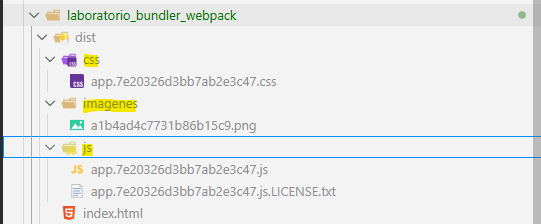

Borramos webpack.config.js y comprobamos que todo sigue funcionando correctamente:

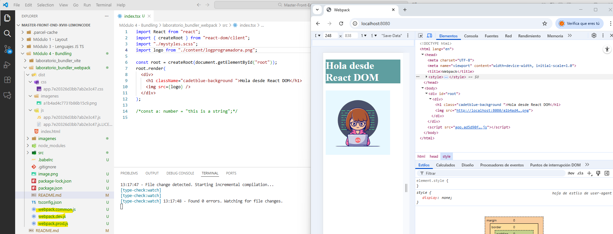

### Tener variables de entorno para diferentes entornos (desarrollo y producción).

Vamos a instalar **`dotenv-webpack`**:

```bash
npm install dotenv-webpack --save-dev
```

Creamos dos archivos para nuestros entornos, uno para desarrollo y otro para producción con la variable ENTORNO:

_./dev.env_

```
ENTORNO = 'Entorno DEV'
```

_./prod.env_

```
ENTORNO = 'Entorno PROD'
```

Modificamos el archivo para desarrollo **`webpack.dev.js`**:

_./webpack.dev.js_

```diff
import { merge } from "webpack-merge";
import common from "./webpack.common.js";
import path from "path";
import url from "url";
+ import Dotenv from "dotenv-webpack";

const __dirname = path.dirname(url.fileURLToPath(import.meta.url));

export default merge(common, {
  mode: "development",
  module: {
    rules: [
      {
        test: /\.scss$/,
        exclude: /node_modules/,
        use: ["style-loader", "css-loader", "sass-loader"],
      },
            {
        test: /\.css$/,
        exclude: /node_modules/,
        use: ["style-loader", "css-loader"],
      },
    ],
  },
  devtool: "eval-source-map",
  devServer: {
    port: 8080,
    devMiddleware: { stats: "errors-only" },
  },
+    plugins: [
+		new Dotenv({
+			path: "./dev.env",
+		}),
+    ],
});
```

Creamos el archivo para producción **`webpack.prod.js`**:

_./webpack.prod.js_

```diff
import { merge } from "webpack-merge";
import common from "./webpack.common.js";
import MiniCssExtractPlugin from "mini-css-extract-plugin";
+ import Dotenv from "dotenv-webpack";

export default merge(common, {
  mode: "production",
  module: {
    rules: [
      {
        test: /\.scss$/,
        exclude: /node_modules/,
        use: [MiniCssExtractPlugin.loader, "css-loader", "sass-loader"],
      },
      {
        test: /\.css$/,
        exclude: /node_modules/,
        use: [MiniCssExtractPlugin.loader, "css-loader"],
      },
    ],
  },
  plugins: [
    new MiniCssExtractPlugin({
      filename: "[name].css",
      chunkFilename: "[id].css",
    }),
+		new Dotenv({
+			path: "./prod.env",
+		}),
  ],
});
```

Incluimos en el **`index.tsx`** un párrafo para mostrar la variable de entorno con una nueva clase para incluir otro color de texto:

_./index.tsx_

```diff
const root = createRoot(document.getElementById("root"));
root.render(
  <div>
    <h1 className="cadetblue-background">Hola desde React DOM</h1>
+   <p className="entorno-background">{process.env.ENTORNO}</p>
    
  </div>
);
```

_./mystyles.scss_

```css
$back-color: cadetblue;
$letra-color: white;
$entorno-color: rgb(233, 73, 166);
$font: bold;

.cadetblue-background {
  background-color: $back-color;
  color: $letra-color;
  font-weight: $font;
}
.entorno-background {
  background-color: $entorno-color;
  color: $letra-color;
  font-weight: $font;
}
img {
  width: 200px;
}
```

Y el resultado:

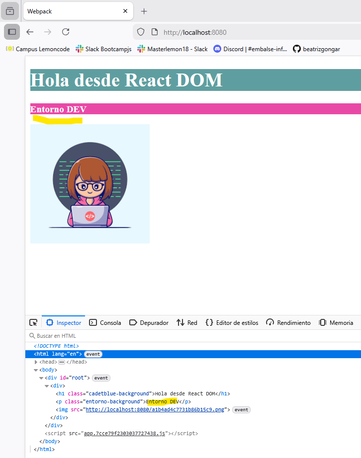

Agregamos una nueva línea de configuración al **`package.json`** para iniciar nuestro servidor en modo producción.

_./package.json_

```diff
  "scripts": {
    "start": "run-p -l type-check:watch start:dev",
    "type-check": "tsc --noEmit",
    "type-check:watch": "npm run type-check -- --watch",
    "start:dev": "webpack serve --config webpack.dev.js",
+   "start:prod": "webpack serve --config webpack.prod.js",
    "build:dev": "webpack --config webpack.dev.js",
    "build:prod": "webpack --config webpack.prod.js"
  },
```

Ejecutamos el start de producción:

```bash
npm run start:prod
```

Y el resultado:

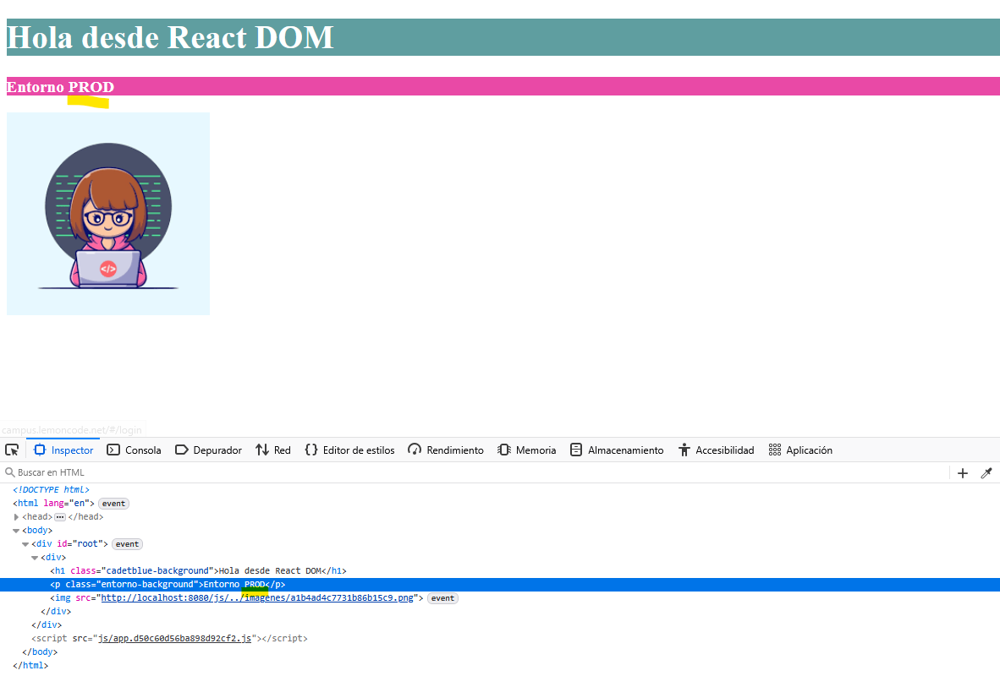

### Tener una forma de medir cuanto ocupa cada librería y nuestro código en el bundle.

Configuramos el **`plugin`** **`Wepback Bundle Analyzer`**

```bash
npm install webpack-bundle-analyzer --save-dev
```

Creamos una nueva configuración de **`webpack`**, la llamaremos **`webpack.perf.js`** donde utilizaremos como base el bundle de producción.

_./webpack.perf.js_

```javascript
import { merge } from "webpack-merge";
import prod from "./webpack.prod.js";
import { BundleAnalyzerPlugin } from "webpack-bundle-analyzer";

export default merge(prod, {
  plugins: [new BundleAnalyzerPlugin()],
});
```

Creamos un nuevo script en package.json:

_./package.json_

```diff
  "scripts": {
    "start": "run-p -l type-check:watch start:dev",
    "type-check": "tsc --noEmit",
    "type-check:watch": "npm run type-check -- --watch",
    "start:dev": "webpack serve --config webpack.dev.js",
    "start:prod": "webpack serve --config webpack.prod.js",
    "build:dev": "webpack --config webpack.dev.js",
    "build:prod": "webpack --config webpack.prod.js",
+   "build:perf": "npm run type-check && webpack --config webpack.perf.js"
  },
```

Ejecutamos el **`script`**:

```bash
npm run build:perf
```

Y el resultado:

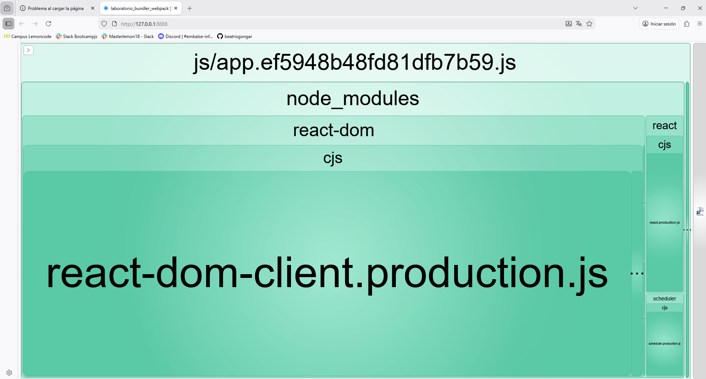
